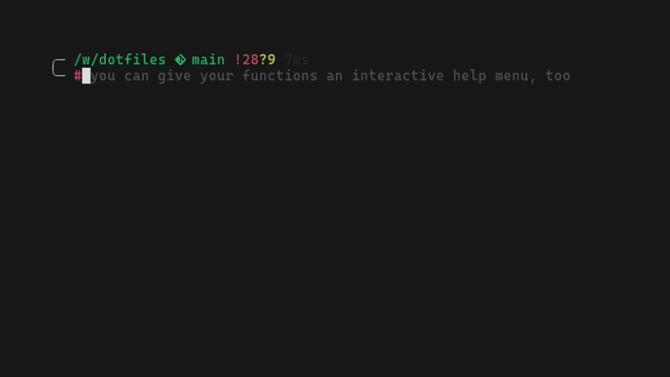

<div align="center">
  <!-- Illustration of an underwater haven where the sand is etched with bright, neon circuit motifs. Schools of robot-like fish with a metallic luster navigate amidst fluorescent marine plants. A radiant shell opens, standing out as a guiding light for the marine tech realm. -->
  
  <h1><code>dotfiles</code></h1>
</div>

_Dotfiles_ are your configuration files used to personalize Unix-like systems. This repository also contains the Bash scripts for installing my dotfiles as well as additional software and tools.

See [dotfiles.github.io](https://dotfiles.github.io) for more on dotfiles as well as popular tools and example repos to explore. In Codespaces, GitHub will automatically clone and run the [`install.sh`](./install.sh) script, so your terminal experience will be exactly like you're used to ([docs](https://docs.github.com/en/codespaces/customizing-your-codespace/personalizing-github-codespaces-for-your-account#dotfiles)).

_Looking to simply sync settings across computers? See [lra/mackup](https://github.com/lra/mackup) or [twpayne/chezmoi](https://github.com/twpayne/chezmoi). Manage symlinks? See [GNU Stow](https://gnu.org/software/stow)._

### Installation

```sh
git clone https://gh.aef.me/dotfiles.git ~/.dotfiles
~/.dotfiles/install.sh
```

The `install.sh` script calls the functions in [`lib`](./lib/). This folder contains scripts to perform individual tasks. It is inspired by the old Microsoft dev container [script **lib**rary](https://github.com/microsoft/vscode-dev-containers/tree/main/script-library) (now [_"features"_](https://github.com/devcontainers/features)).

  * [`apt.sh`](./lib/apt.sh)
  * [`bun.sh`](./lib/bun.sh)
  * [`chsh.sh`](./lib/chsh.sh)
  * [`clean.sh`](./lib/clean.sh)
  * [`clone.sh`](./lib/clone.sh)
  * [`deb.sh`](./lib/deb.sh)
  * [`deno.sh`](./lib/deno.sh)
  * [`fish.sh`](./lib/fish.sh)
  * [`go.sh`](./lib/go.sh)
  * [`homebrew.sh`](./lib/homebrew.sh)
  * [`link.sh`](./lib/link.sh)
  * [`nerdfont.sh`](./lib/nerdfont.sh)
  * [`nvm.sh`](./lib/nvm.sh)
  * [`python.sh`](./lib/python.sh)
  * [`rustup.sh`](./lib/rustup.sh)
  * [`sudoers.sh`](./lib/sudoers.sh)

For example:

```sh
# install bun for your OS and arch
./lib/bun.sh

# install pyenv from GitHub with Python 3.11.6 (and pipx/poetry) using `source`
source lib/python.sh ; dotfiles_python 3.11.6
```

### Git

Most is in [`.config/git/config`](https://github.com/adamelliotfields/dotfiles/blob/main/shared/.config/git/config). The rest goes in `~/.gitconfig`:

```properties
[user]
	name = <your_name> # required
	email = <your_email> # required
	signingkey = <your_key>
[diff]
	tool = <smerge|code>
[merge]
	tool = <smerge|code>
[commit]
	gpgsign = true
[gpg]
	program = /path/to/gpg
```

See the [`git config`](https://git-scm.com/docs/git-config#FILES) docs for details on how the files are resolved.

### Secrets

All shell RC files source `~/.secrets` if it exists. This file should be a series of `export VAR=val` statements. Not in Git obvi.

### Fish

I :heart: [Fish](https://fishshell.com). The language is more expressive than Bash and the shell is designed for interactive use.



These are some of the [functions](https://fishshell.com/docs/current/tutorial.html#autoloading-functions) I've written:

* [`chat`](https://github.com/adamelliotfields/dotfiles/blob/main/shared/.config/fish/functions/chat.fish) - OpenAI/Perplexity API Chat CLI
* [`drac`](https://github.com/adamelliotfields/dotfiles/blob/main/shared/.config/fish/functions/drac.fish) - Dracula Pro theme switcher for Hyper
* [`fish_prompt`](https://github.com/adamelliotfields/dotfiles/blob/shared/mac/.config/fish/functions/fish_prompt.fish) - My custom prompt 🐠
* [`gituser`](https://github.com/adamelliotfields/dotfiles/blob/main/shared/.config/fish/functions/gituser.fish) - Update `~/.gitconfig` with email address and corresponding GPG key
* [`goog`](https://github.com/adamelliotfields/dotfiles/blob/main/shared/.config/fish/functions/goog.fish) - Open various Google pages with params
* [`mkcd`](https://github.com/adamelliotfields/dotfiles/blob/main/shared/.config/fish/functions/mkcd.fish) - Make a directory and change into it
* [`nvm`](https://github.com/adamelliotfields/dotfiles/blob/main/shared/.config/fish/functions/nvm.fish) - NVM proxy via [replay](https://github.com/jorgebucaran/replay.fish)
* [`postgres`](https://github.com/adamelliotfields/dotfiles/blob/main/shared/.config/fish/functions/postgres.fish) - Run a Postgres [container](https://hub.docker.com/_/postgres)
* [`pypi`](https://github.com/adamelliotfields/dotfiles/blob/main/shared/.config/fish/functions/pypi.fish) - Search PyPI for package information
* [`redis`](https://github.com/adamelliotfields/dotfiles/blob/main/shared/.config/fish/functions/redis.fish) - Run a Redis Stack [container](https://hub.docker.com/r/redis/redis-stack) with RedisInsight web GUI
* [`ubuntu`](https://github.com/adamelliotfields/dotfiles/blob/main/shared/.config/fish/functions/ubuntu.fish) - Run an Ubuntu [container](https://github.com/devcontainers/images/tree/main/src/base-ubuntu) mounted to the current directory
* [`up`](https://github.com/adamelliotfields/dotfiles/blob/main/shared/.config/fish/functions/up.fish) - Move up $n$ directories

### `vhs`

Use [`vhs`](https://github.com/charmbracelet/vhs) to create terminal screen recordings using [code](./fish.tape). The [`base-ubuntu`](https://github.com/devcontainers/images/tree/main/src/base-ubuntu) dev container image requires some additional packages to install:

```sh
# install ffmpeg and dependencies
sudo apt install -y ffmpeg libnss3-dev libatk-bridge2.0-0 libcups2 libxcomposite-dev libxdamage-dev

# use gh cli to download
gh -R charmbracelet/vhs release download -p '*Linux_x86_64.tar.gz'
gh -R tsl0922/ttyd release download -p 'ttyd.x86_64' -O ttyd

# extract and move binaries
tar -xzf vhs_*_Linux_x86_64.tar.gz
sudo mv vhs /usr/local/bin
sudo mv ttyd /usr/local/bin
sudo chmod +x /usr/local/bin/vhs
sudo chmod +x /usr/local/bin/ttyd

# cleanup
rm -f vhs_*_Linux_x86_64.tar.gz

# create `fish.gif` (downloads chromium first time)
vhs fish.tape
```

### Inspiration

* [jessfraz/dotfiles](https://github.com/jessfraz/dotfiles)
* [holman/dotfiles](https://github.com/holman/dotfiles)
* [dotphiles/dotphiles](https://github.com/dotphiles/dotphiles)
* [alexanderepstein/bash-snippets](https://github.com/alexanderepstein/Bash-Snippets)
