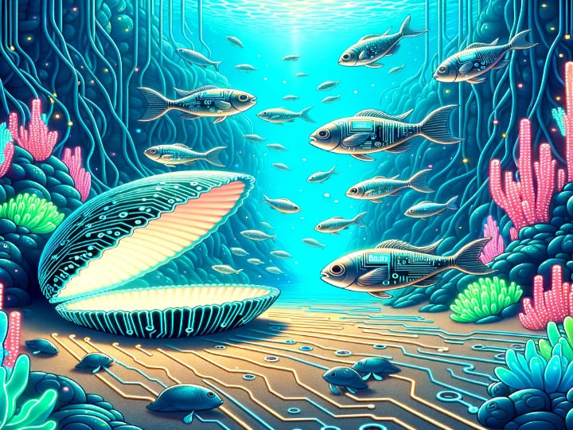

<div align="center">
  <!-- Illustration of an underwater haven where the sand is etched with bright, neon circuit motifs. Schools of robot-like fish with a metallic luster navigate amidst fluorescent marine plants. A radiant shell opens, standing out as a guiding light for the marine tech realm. -->
  
  <h1 align="center"><code>dotfiles</code></h1>
</div>

These are my configuration files and shell scripts that I use across all my _personal computers_ :octocat:

## Usage

```sh
git clone https://github.com/adamelliotfields/dotfiles.git ~/.dotfiles
~/.dotfiles/install
```

## Lib

The [`install`](./install) script calls the functions in [`lib`](./lib/):
  * [`dotfiles_apt`](./lib/apt.sh)
  * [`dotfiles_chsh`](./lib/chsh.sh)
  * [`dotfiles_clone`](./lib/clone.sh)
  * [`dotfiles_deb`](./lib/deb.sh)
  * [`dotfiles_deno`](./lib/deno.sh)
  * [`dotfiles_go`](./lib/go.sh)
  * [`dotfiles_homebrew`](./lib/homebrew.sh)
  * [`dotfiles_link`](./lib/link.sh)
  * [`dotfiles_nvm`](./lib/nvm.sh)
  * [`dotfiles_python`](./lib/python.sh)
  * [`dotfiles_rustup`](./lib/rustup.sh)
  * [`dotfiles_sudoers`](./lib/sudoers.sh)

## Git

I use 2 Git config files:
  1. [`~/.config/git/config`](./shared/.config/git/config) - global read-only config (in Git)
  2. `~/.gitconfig` - global user config (not in Git)

When you run `git config --global`, it won't write to `~/.config/git/config` if `~/.gitconfig` exists. This mechanism makes it convenient for the latter to store "dynamic" information like email address and GPG key.

A sample `~/.gitconfig` looks like this:

```properties
[user]
	name = <your_name> # required
	email = <your_email> # required
	signingkey = <your_key>
[diff]
	tool = <smerge|code>
[merge]
	tool = <smerge|code>
[commit]
	gpgsign = true
[gpg]
	program = /path/to/gpg
```

## Fish

I've been using Fish for a few years. My favorite feature is [function autoloading](https://fishshell.com/docs/current/tutorial.html#autoloading-functions). Unlike other shells that require you to explicitly `source` a file (or loop over a folder of files), Fish can load functions on-demand. If you call `foo` and it isn't in your `PATH`, Fish will look for it in `$fish_function_path`. This also means you can edit functions and they'll be "hot reloaded" the next time you call them.

### Functions

* [`drac`](https://github.com/adamelliotfields/dotfiles/blob/main/mac/.config/fish/functions/drac.fish) - Dracula Pro theme switcher for Hyper
* [`fgpt`](https://github.com/adamelliotfields/dotfiles/blob/main/mac/.config/fish/functions/fgpt.fish) - OpenAI GPT CLI
* [`fish_prompt`](https://github.com/adamelliotfields/dotfiles/blob/main/mac/.config/fish/functions/fish_prompt.fish) - My custom prompt 🐠
* [`gituser`](https://github.com/adamelliotfields/dotfiles/blob/main/mac/.config/fish/functions/gituser.fish) - Update `~/.gitconfig` with email address and corresponding GPG key
* [`goog`](https://github.com/adamelliotfields/dotfiles/blob/main/mac/.config/fish/functions/goog.fish) - Open various Google pages with params
* [`mkcd`](https://github.com/adamelliotfields/dotfiles/blob/main/mac/.config/fish/functions/mkcd.fish) - Make a directory and change into it
* [`nvm`](https://github.com/adamelliotfields/dotfiles/blob/main/mac/.config/fish/functions/nvm.fish) - NVM proxy via [replay](https://github.com/jorgebucaran/replay.fish)
* [`postgres`](https://github.com/adamelliotfields/dotfiles/blob/main/mac/.config/fish/functions/postgres.fish) - Run a Postgres [container](https://hub.docker.com/_/postgres)
* [`redis`](https://github.com/adamelliotfields/dotfiles/blob/main/mac/.config/fish/functions/redis.fish) - Run a Redis Stack [container](https://hub.docker.com/r/redis/redis-stack) with RedisInsight web GUI
* [`ubuntu`](https://github.com/adamelliotfields/dotfiles/blob/main/mac/.config/fish/functions/ubuntu.fish) - Start an Ubuntu [container](https://github.com/devcontainers/images/tree/main/src/base-ubuntu) mounted to the current directory
* [`up`](https://github.com/adamelliotfields/dotfiles/blob/main/mac/.config/fish/functions/up.fish) - Move up $n$ directories

## Games

> “Some men see things as they are and ask why. Others dream things that never were and ask **_why not_**.” ― [George Bernard Shaw](https://www.goodreads.com/quotes/3544293-some-men-see-things-as-they-are-and-ask-why)

Terminal games you can install with `apt` :joystick:

* `bsdgames` - classic games
* `vitetris` - tetris clone
* `pacman4console` - pacman clone
* `ninvaders` - space invaders clone
* `nudoku` - sudoku clone
* `nsnake` - snake clone
* `greed` - clone of snake-like DOS game
* `moon-buggy` - 2d platformer

## References

* [jessfraz/dotfiles](https://github.com/jessfraz/dotfiles)
* [holman/dotfiles](https://github.com/holman/dotfiles)
* [dotphiles/dotphiles](https://github.com/dotphiles/dotphiles)
* [alexanderepstein/bash-snippets](https://github.com/alexanderepstein/Bash-Snippets)
* [lra/mackup](https://github.com/lra/mackup)
* [GitHub Does Dotfiles](https://dotfiles.github.io)
* [Personalizing GitHub Codespaces for your account](https://docs.github.com/en/codespaces/customizing-your-codespace/personalizing-github-codespaces-for-your-account#dotfiles)
* [Chezmoi](https://chezmoi.io)
* [GNU Stow](https://gnu.org/software/stow)
