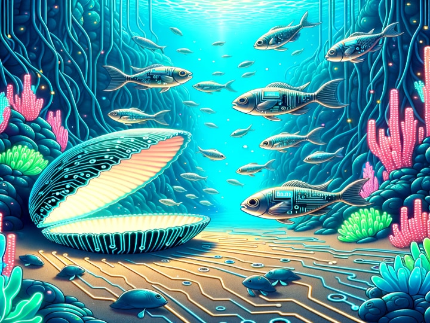

<div align="center">
  
  <h1><code>dotfiles</code></h1>
</div>

See [GitHub does dotfiles](https://dotfiles.github.io).

## Installation

```sh
git clone https://gh.aef.me/dotfiles.git
./dotfiles/install.sh
```
